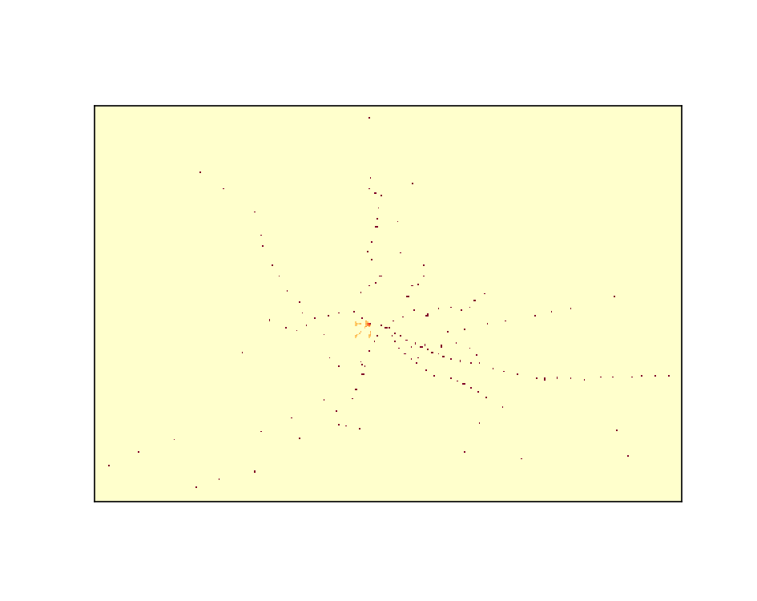
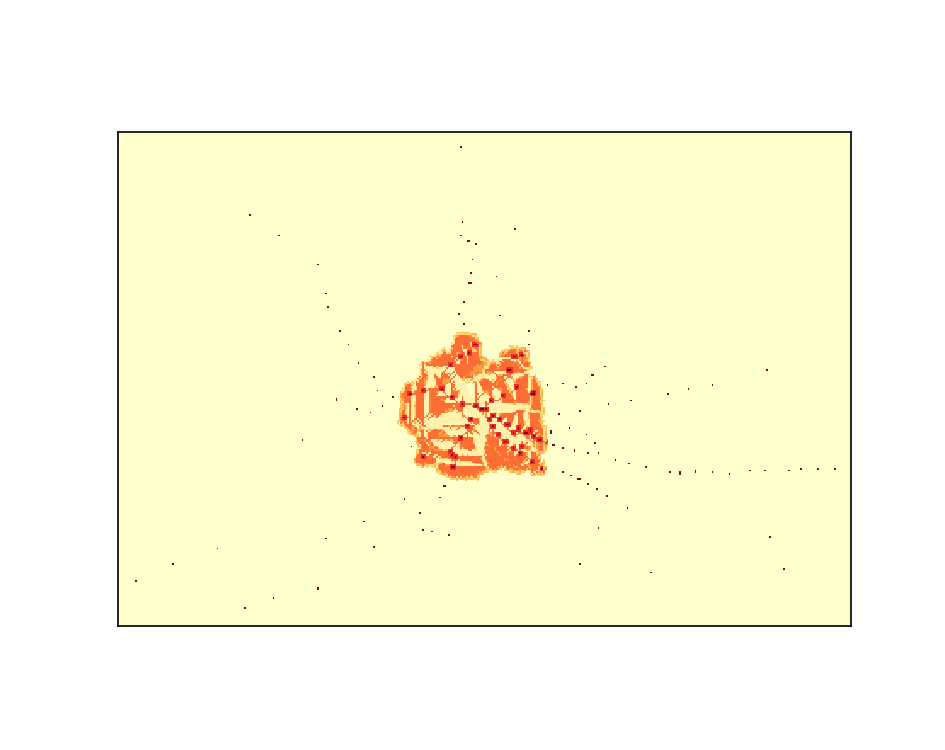
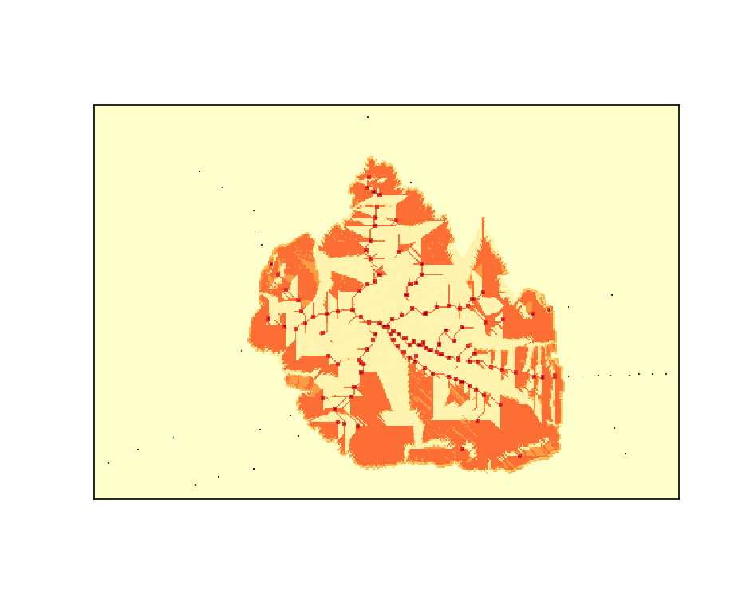
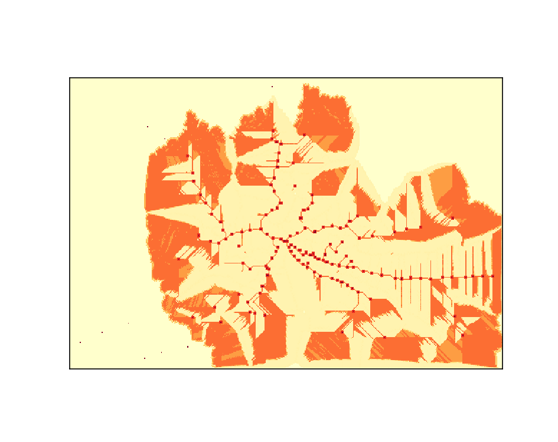
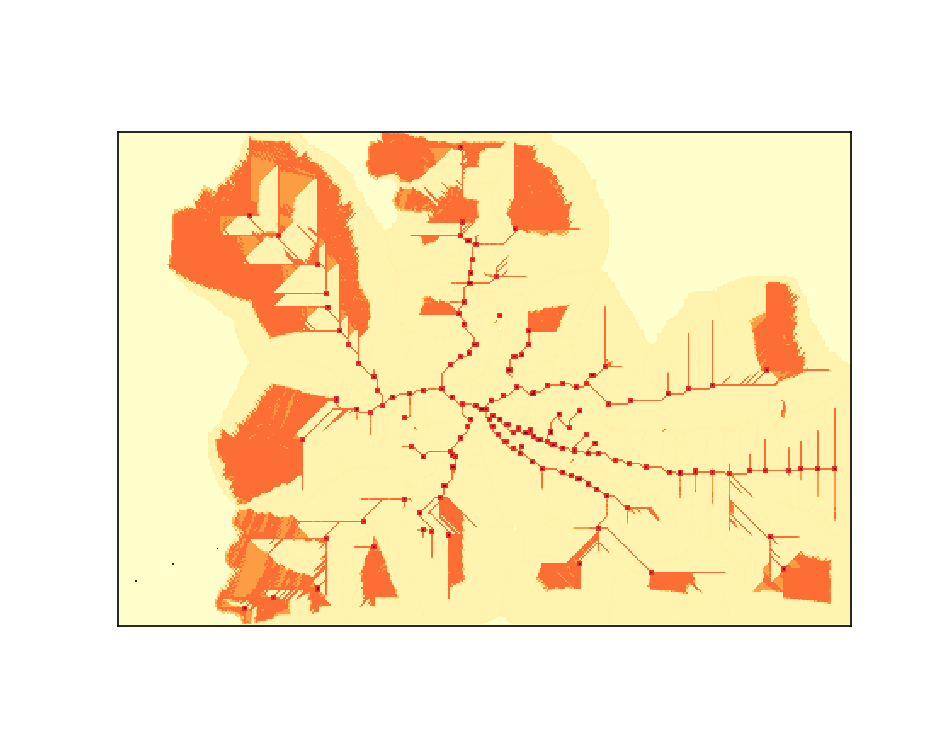
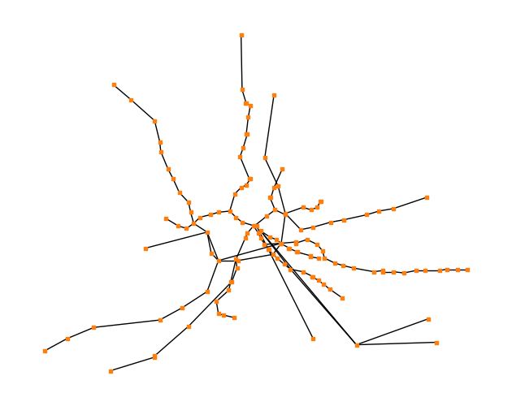
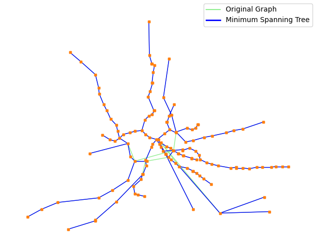
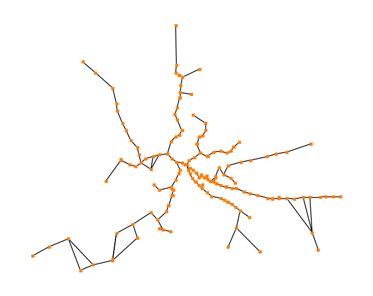

## Example output animations

   
  

  
  

  

## Network comparison

### Original Graph

### Minimal Spanning Tree (MST) Graph

### Slime Mould Graph
  

## Mesa project

   

## Background

The concept behind this project is to attempt to model networks based on a Slime Mould Algorithm (SMA), first popularised by Tero et al. 2010 in their paper 'Rules for Biologically Inspired Adaptive Network Design'.
In their paper they successfully modelled Tokyo's railway system via a natural growth by a slime mold, called Physarum polycephalum, to develop a biologically inspired model for adaptive network development.

I have modified the model created by Wenxiao Zhang (https://github.com/MoeBuTa/SlimeMould) which accurately mimics a SMA to apply it to Romes Railway Network. You can find further details about the model on the GitHub repository.
However, as stated in the report by Zhang, a limitation of the current design is the lack of understanding and optimisation of the variables.
I have transferred the model over to python's Mesa project which allows for live visualisation and modification of variables. 
This was done in order for this projects future development to continue, as static variables do not allow for dynamic progress in science.

## Preprocessing

Contained in the files is the code used to filter the geojson data selected from Kujala et al. 2018 from the paper 'A collection of public transport network data sets for 25 cities'.
After the filtering of both the subway and railway paths and nodes they were then combined and visualised on the website https://geojson.io.
After filtering misaligned data, the combined routes and stops were saved as 2 individual files which were then used later on.

## Mesa

The Mesa project, 'Slime Mould Basic', has the capabilities to create live visualisation of the model according to the now preprocessed stops.
If you are updating the code in order to set new data points in, then note that:
  - The path for the new data points must be updated in both the 'visualization.py' file (geojson_path under server) and at the 'mould_model.py' file (geojson_path at the start under the model class)
  - The center point/start location for the slime has been set manually and can be done in the mould_model.py file by the loading of the stations (set in the code: class MouldModel(Model)).
      - These coordinates are x and y respectively according to the grid_width and grid_height. (Currently both set at 200)
   
## Analysis

Further analysis of the model was done using UCloud JupyterLab where the rome_simulation.ipynb is used. 
This markdown allows for the analysis and comparison of: the original mode, minimal spanning tree (MST) model and the slime mould algorithm.
The statistics created from the analysis allow for a 'small world property' mertic of evaluation, but also MST normalized comparisons of cost and efficiency of the models ike in the original paper by Tero et al.
This analysis does not perform an analysis on robustness like the paper by Tero et al. due to structural differences on model design between the 2 models. 
It does however allow for quantifying the structural property characteristics of the model via: path length and clustering coefficient, which are the 2 metrics required to perform a 'small world property' evaluation.

 
